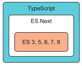
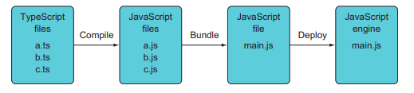
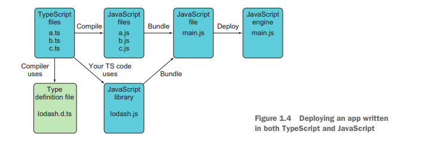

# Part 1 Chapter 1 : Getting familiar with TypeScript

**Typescript is a superset of javascript** 

**Typical TypeScript workflows**

and here with js library called lodash 
  (supporst piplines and many functional programming features)

### Code Example
suppose we created a `main.ts` file containing the following code
>**Typescript**
<pre style="background:#eef">
const getFinalPrice = (price: Number, discount:Number): Number => {
  return price - price / discount;
}
console.log(getFinalPrice(100, 20));
</pre>
where 

Number: is type of parameter 

Number: is type of the return value 

in terminal `tsc main.ts`

>**Javascript** output is generated in `main.js` file
<pre style="background:#fee">
const getFinalPrice = (price: Number, discount:Number): Number => {
  return price - price / discount;
}
console.log(getFinalPrice(100, 20));
</pre>

### Configuration options
there are many configuratio options are provided by tsc (Typescript compiler)
such as 
`tsc --t ES5 (or ES6) main ` to generate js cod compatible with ES5 or ES6 also 
`tsc main --noEmitOnError true` to prevent generating js files if there are compilation errors.
A **` tsconfig.json`** file could be created to contain the configuration options and tsc will look on them every time (see [tsconfig.json](./starter_code/tsconfig.json) of starter_code)
